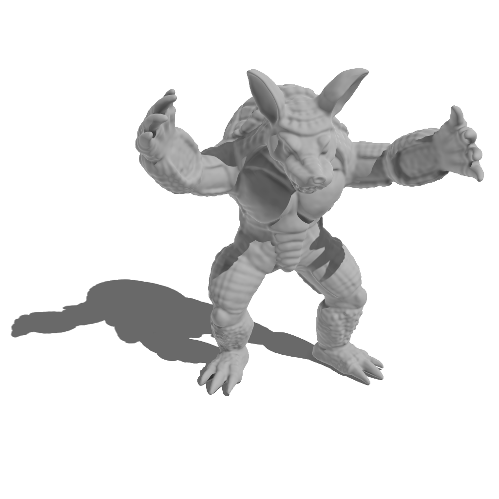
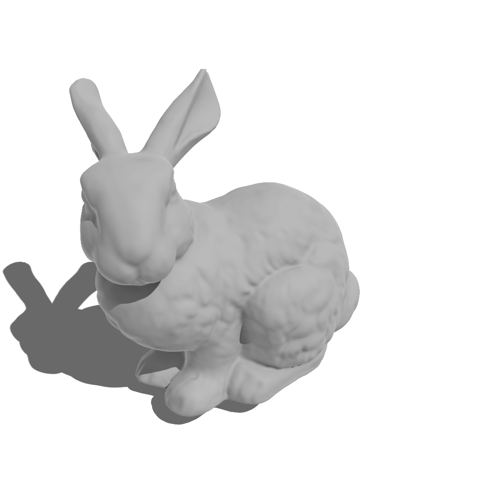
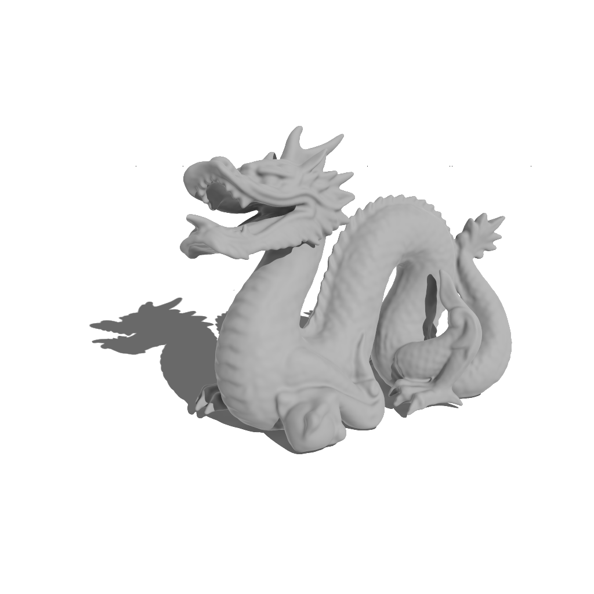
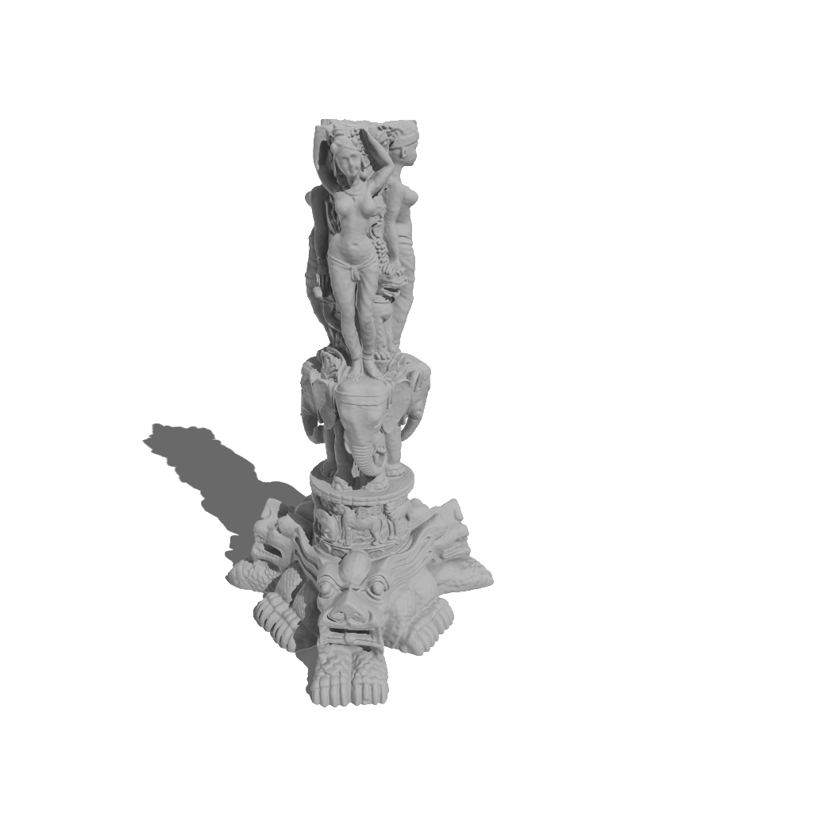

## Setup
```
python3 -m venv venv # setup virtual env, only need to run once
source venv/bin/activate # activate virtual env
python3 -m pip install -r requirements.txt # install deps
```

## Training
The input mesh is expected to be in pointcloud (.xyz) format with surface normals included.
We have included the models used for this experiment in `data/`.
All models were taken from the official stanford 3d scanning repo https://graphics.stanford.edu/data/3Dscanrep/ and we used Meshlab to convert them into (.xyz).
```
python3 train.py --point_cloud_path data/bunny.xyz --batch_size 250_000 --final_model_path net/armadillo.pth --epochs 10_000
```

To start tensorboard to visualize training progress:
```
tensorboard --logdir=logs
```

## Render Image
We have included our trained neural networks in `net/`.
`--samples` is for antialiasing. How many samples to accumulate for each pixel.
```
python3 render.py --width 512 --height 512 --output_path out/bunny --model_path net/bunny.pth --samples 1 --max_iter 50 --camera_angle 0.33 --camera_height 1.3 --key_light 0.4 1.5 1.4
```

## Showcase
<p align="center">
  
</p>

```
python3 render.py --width 1024 --height 1024 --output_path out/armadillo --model_path net/armadillo.pth --samples 128 --camera_angle 0.8 --camera_height 1 --camera_target 0.4 0 0 --key_light -1 1.5 -1.4 --max_iter 230
```

<p align="center">
  
</p>

```
python3 render.py --width 1024 --height 1024 --output_path out/bunny --model_path net/bunny.pth --samples 128 --max_iter 200 --camera_angle 0.33 --camera_height 1.3 --key_light 0.4 1.5 1.4
```

<p align="center">
  
</p>

```
python3 render.py --width 1024 --height 1024 --output_path out/dragon --model_path net/dragon.pth --samples 128 --max_iter 200 --camera_angle 0.35 --camera_height 0.6 --ground -0.622 --key_light 0 1.5 3 --camera_target -0.4 0 0
```

<p align="center">
  
</p>

```
python3 render.py --width 1024 --height 1024 --output_path out/thai --model_path net/thai.pth --samples 128 --camera_height 1.2 --max_iter 250
```